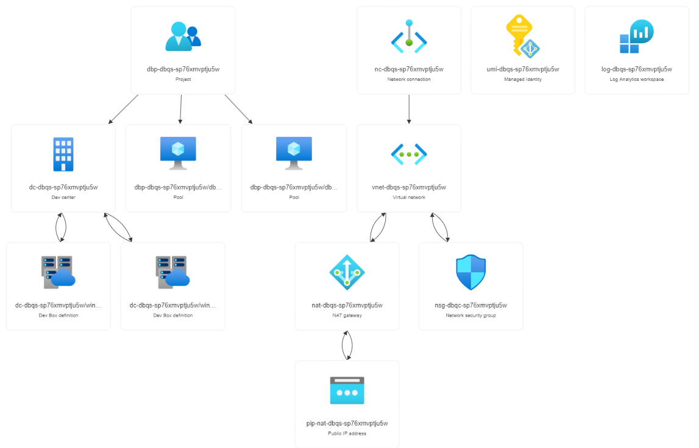

# DevBoxQuickStart 1.0

This project makes w10/w11 Dev Boxes avaible to the selected Entra ID Security Group with a Azure Virtual Network that can be connected to most things. 

## What is Microsoft Dev Box?

Microsoft Dev Box is an Azure service designed to enhance developer productivity by providing self-service access to cloud-based workstations—referred to as dev boxes. These dev boxes are meticulously preconfigured, project-specific environments that allow developers to dive straight into coding without the hassle of manual setup or configuration. 

Self-Service Access: Developers can access Microsoft Dev Box on demand, creating a seamless experience for setting up their development environment. Gone are the days of waiting for IT teams to provision workstations; with Dev Box, developers take control of their own setup.

Preconfigured Developer Boxes: Dev boxes come preloaded with essential tools, libraries, and dependencies specific to the project.

Avoid Configuration Conflicts: Working across multiple dev boxes is a breeze. Developers can switch between different project contexts without worrying about conflicting configurations.

Integration with Microsoft Intune: Dev Box management extends beyond the virtual realm. Dev Boxes are automatically managed with Microsoft Intune.

Project-Based Configurations: Dev Box images can be tailored to match specific workflows. Whether it’s a web app, machine learning project, or game development, each dev box is customized.

   

## Overview

This project deploys the following Azure resource types:

- Dev Box Center
- Dev Box Project
- Dev Box Pools 
- User Managed Identity

## Deployment

1. Hit the blue "Deploy" button below.

2. Specify your settings. 

   Example:

   location = 'eastus2'

   vnetspace = '192.168.0.0/22'

   mainsnetspace = '192.168.0.0/22'

   stoptime = '19:00'

   stoptimezone = 'America/Chicago'

   dbusergroupid = 'the entra id client id of the security group for Dev Box'
   
   dblocaladmin = 'Enabled'

3. Login to your Microsoft Dev Box. 

